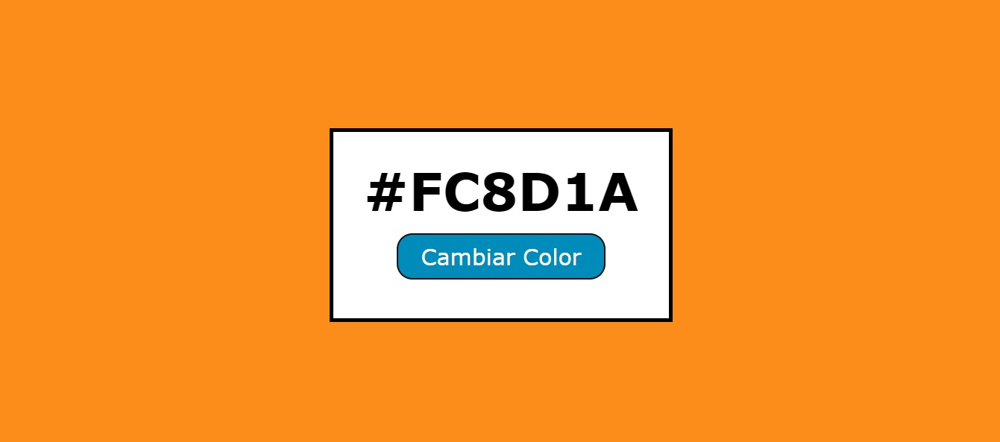
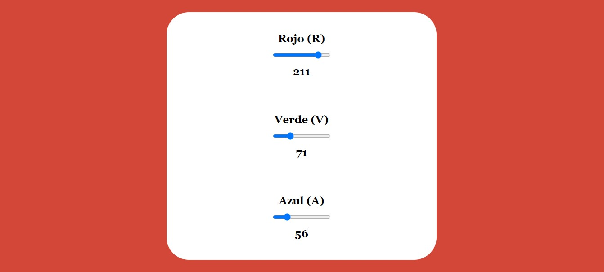
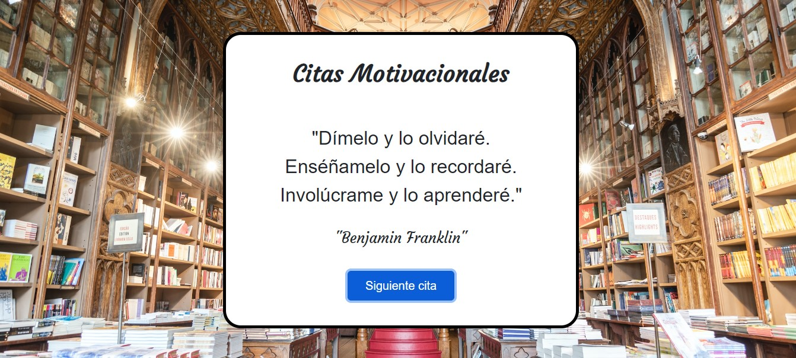
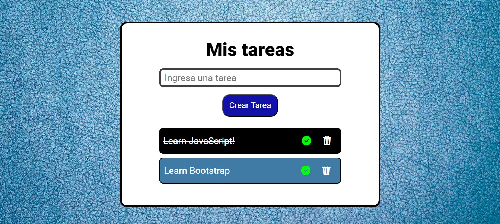

# Curso de JavaScript para Manipulación del DOM

Este repositorio contiene los proyectos y materiales del curso de JavaScript para la manipulación del DOM. El curso se basa en el video de FreeCodeCamp disponible en [YouTube](https://youtu.be/koiPxFFiqJ4?si=wvMZ4V2gyFiUNagG).

## Contenido del Curso

### Programas y Framework Utilizadas
- HTML
- CSS
- JavaScript (ES6)
- Bootstrap

### Proyectos

#### 1. Colores Aleatorios
Genera colores aleatorios con un clic. Ideal para practicar eventos de clic y manipulación del DOM.

#### 2. Colores RGB con Sliders
Utiliza sliders para ajustar los componentes RGB y visualizar el color resultante. Ideal para practicar el uso de formularios y eventos de cambio.

#### 3. Cronómetro
Implementa un cronómetro simple con funciones de inicio, pausa y reinicio. Ideal para practicar funciones temporizadoras en JavaScript.

#### 4. Citas Aleatorias
Muestra citas aleatorias en la página. Ideal para practicar el manejo de arreglos y la actualización del contenido HTML.

#### 5. Lista de Tareas
Crea, edita y elimina tareas. Ideal para practicar la manipulación de listas y almacenamiento local.

## Créditos

- **Favicon:** [Flaticon](https://www.flaticon.com/)
- **Bootstrap Icons:** [Bootstrap Icons](https://icons.getbootstrap.com/)
- **Imágenes:** [Unsplash](https://unsplash.com/pt-br)

## Ver Proyectos

Puedes visualizar todos los proyectos completos del curso [aquí](https://evelinalvarado.github.io/course-javascript-dom-freecodecamp/).
